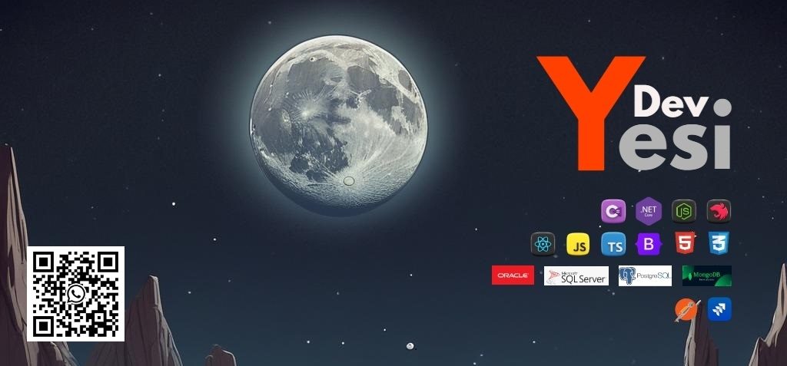

Here are some ideas to get you started:

- 🔭 I’m currently working on ...
- 🌱 I’m currently learning ...
- 👯 I’m looking to collaborate on ...
- 🤔 I’m looking for help with ...
- 💬 Ask me about ...
- 📫 How to reach me: ...
- 😄 Pronouns: ...
- ⚡ Fun fact: ...

    

<h1>Hello, I'm </h1> <h1>Dev</h1> <h1>Yesi</h1>  

 

  

  <h3 align="center">Best-README-Template</h3>

